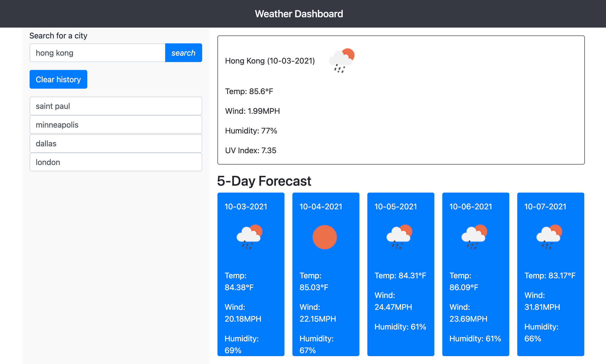

# Weather Dashboard

- The weather dashboard is an interactive webpage that allows a user to input any city and get back a daily and 5 day forecast. 

## Dashboard Project

- In this project I was asked to use the  OpenWeather One Call API and meet the following criteria.

1. GIVEN a weather dashboard with form inputs
WHEN I search for a city
THEN I am presented with current and future conditions for that city and that city is added to the search history

2. WHEN I view current weather conditions for that city
THEN I am presented with the city name, the date, an icon representation of weather conditions, the temperature, the humidity, the wind speed, and the UV index

3. WHEN I view the UV index
THEN I am presented with a color that indicates whether the conditions are favorable, moderate, or severe

4. WHEN I view future weather conditions for that city
THEN I am presented with a 5-day forecast that displays the date, an icon representation of weather conditions, the temperature, the wind speed, and the humidity

5. WHEN I click on a city in the search history
THEN I am again presented with current and future conditions for that city

6. created a repository on GitHub at URL https://github.com/mmelendez3/weather-dashboard

7. This is the address of the live URL https://mmelendez3.github.io/weather-dashboard/

8. Here is a screenshot of the finished website.

    - 